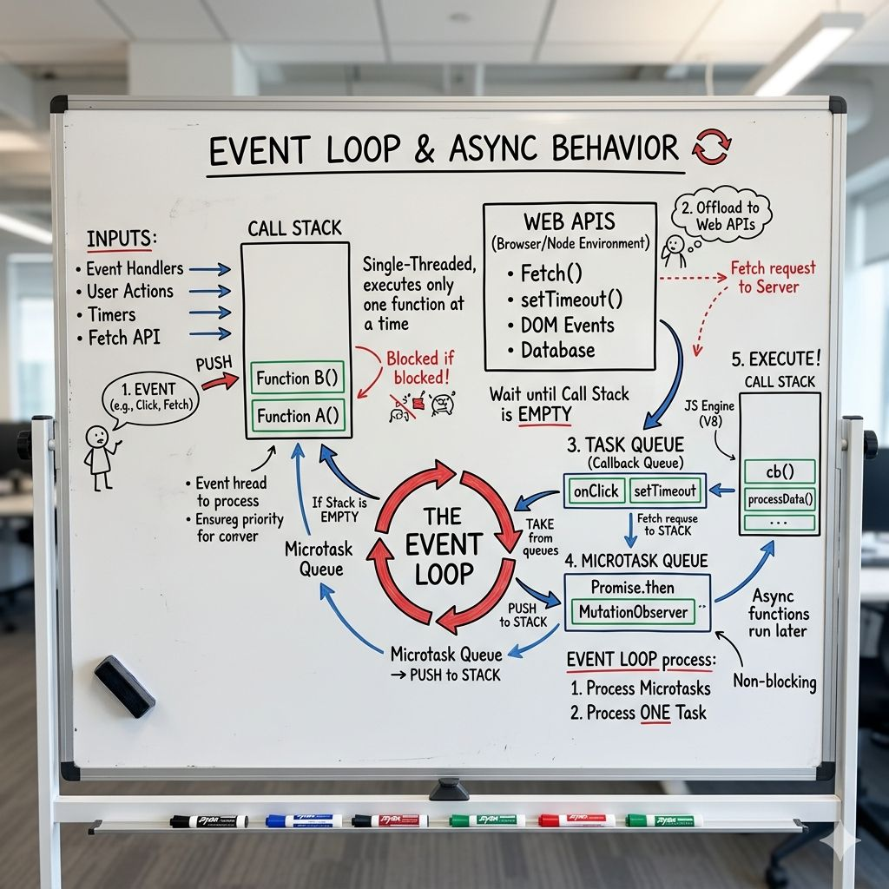

# E𝘃𝗲𝗻𝘁 𝗹𝗼𝗼𝗽 𝘄𝗶𝘁𝗵 A𝘀𝘆𝗻𝗰 𝗯𝗲𝗵𝗮𝘃𝗶𝗼𝗿

ASKED : "𝗘𝘅𝗽𝗹𝗮𝗶𝗻 𝘁𝗵𝗲 𝗝𝗮𝘃𝗮𝗦𝗰𝗿𝗶𝗽𝘁 𝗲𝘃𝗲𝗻𝘁 𝗹𝗼𝗼𝗽 𝘄𝗶𝘁𝗵 𝗮𝘀𝘆𝗻𝗰 𝗯𝗲𝗵𝗮𝘃𝗶𝗼𝗿?"

Me: "JavaScript is single-threaded. The event loop handles async operations by using the call stack and callback queue."

Interviewer: "What about microtasks vs macrotasks?"

Me: "Um... they're both queues?"

Interviewer: "If I schedule a setTimeout and a Promise, which executes first?"

Me: "...setTimeout?"

Wrong. Interview over.

I knew async/await. I used Promises daily. I'd built complex async applications.

𝗧𝗵𝗲 𝗲𝘃𝗲𝗻𝘁 𝗹𝗼𝗼𝗽 : It's the specific mechanism that coordinates synchronous code, microtasks, macrotasks, and browser APIs to create the illusion of concurrency in a single-threaded language.

𝗧𝗵𝗲 𝗺𝗲𝗻𝘁𝗮𝗹 𝗺𝗼𝗱𝗲𝗹 𝘁𝗵𝗮𝘁 𝗳𝗶𝗻𝗮𝗹𝗹𝘆 𝗺𝗮𝗱𝗲 𝗶𝘁 𝗰𝗹𝗶𝗰𝗸: JavaScript has ONE thread. It can only execute one thing at a time.

𝗕𝘂𝘁 𝗶𝘁 𝗵𝗮𝘀 𝗵𝗲𝗹𝗽:
→ Browser APIs (setTimeout, fetch, DOM events) run outside JavaScript
→ Event loop coordinates what executes when
→ Two separate queues: microtasks and macrotasks

The loop's job: When call stack is empty, check microtasks first. Execute ALL microtasks. Then take ONE macrotask. Repeat.

𝗧𝗵𝗲 𝟰 𝗽𝗶𝗲𝗰𝗲𝘀 𝗺𝗼𝘀𝘁 𝗱𝗲𝘃𝘀 𝗺𝗶𝘀𝘀:

𝟭) 𝗖𝗮𝗹𝗹 𝗦𝘁𝗮𝗰𝗸
Runs synchronous code → Long tasks block everything

𝟮) 𝗠𝗶𝗰𝗿𝗼𝘁𝗮𝘀𝗸 𝗤𝘂𝗲𝘂𝗲 (𝗵𝗶𝗴𝗵 𝗽𝗿𝗶𝗼𝗿𝗶𝘁𝘆)
Promises run here → Always before timers

𝟯) 𝗠𝗮𝗰𝗿𝗼𝘁𝗮𝘀𝗸 𝗤𝘂𝗲𝘂𝗲 (𝗹𝗼𝘄 𝗽𝗿𝗶𝗼𝗿𝗶𝘁𝘆)
setTimeout, events → Runs after microtasks

𝟰) 𝗪𝗲𝗯 𝗔𝗣𝗜𝘀
Browser handles async work → Pushes callbacks to queues

𝗧𝗵𝗲 𝗜𝗻𝘁𝗲𝗿𝘃𝗶𝗲𝘄-𝗪𝗶𝗻𝗻𝗶𝗻𝗴 𝗔𝗻𝘀𝘄𝗲𝗿:
"JavaScript is single-threaded with a call stack. Async work is handled by Web APIs, and callbacks go into queues. Microtasks (Promises) run first, then macrotasks (setTimeout). The event loop executes all microtasks, then one macrotask. That’s why Promises run before setTimeout."

𝗘𝗻𝗱 𝘄𝗶𝘁𝗵 𝟭 𝗰𝗼𝗻𝗰𝗿𝗲𝘁𝗲 𝗲𝘅𝗮𝗺𝗽𝗹𝗲:
You click a button that triggers a fetch.
Click handler runs → fetch goes to browser → handler finishes.

While waiting, user interacts with UI normally.
When data returns, Promise runs (microtask) → UI updates.

Async work doesn’t block the app, it gets scheduled smartly!!
